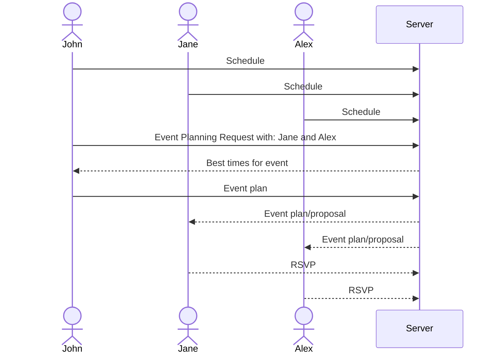

# What's Your Schedule?

[My Notes](notes.md)

Collaborative calendaring specifically designed for college students (though anyone could use it). Allows for schedule sharing and simplified event planning.

## 🚀 Specification Deliverable

### Elevator pitch

College students are an interesting demographic when it comes to event planning. They so much want to hang out with friends and do fun activities, but while that stage in life is often seen as the most "liberating", they ironically struggle to find common free time among the classes, work hours, and other responsibilities. They all have free-time eventually, but finding a common free-time is always a hassle. **_What's Your Schedule_** allows college students (or anyone, for that matter) to easily share their schedule with friends, find common availability, and create event invitations to spend less time coordinating, and more time having fun!

### Design

Here is a sequence diagram that shows how to people would interact with the backend to plan events.

### Key features

- Social Media style schedule sharing (e.g. friends and groups system)
- Plan events and send proposals to friends/groups
    - Service automatically finds best times for events by comparing schedules
    - RSVP to events
    - Make events be conditional one how many people RSVP to it

### Technologies

I am going to use the required technologies in the following ways.

- **HTML** - Uses correct HTML structure for application. Pages for login, viewing ones own schedule and creating events, and viewing another persons schedule.
- **CSS** - Application styling that looks good on different screen sizes, uses good whitespace, color choice and contrast. Clean, modern look.
- **React** - Provides login, schedule management, and event creation
- **Service** - Backend service with endpoints for:
    - login
    - managing schedule
    - event creation
- **DB/Login** - Store users, schedules, and events in database. Register and login users. Credentials securely stored in database. Must be authenticated to do anything.
- **WebSocket** - As events are made, the notification is broadcast to user's friends

## 🚀 AWS deliverable

- [x] **Server deployed and accessible with custom domain name** - [Server link](https://whatsyourschedule.click).

## 🚀 HTML deliverable

Login(index), home, friends, friend_schedule, and about pages added. Placeholder and example data in place.

- [x] I completed the prerequisites for this deliverable (Simon deployed, GitHub link, Git commits)
- [x] **HTML pages** - 5 HTML Pages to represent logging in, the home page, about page, friends page and individual friends' schedules
- [x] **Proper HTML element usage** - Divs, forms, and buttons for interactivity, and some `i` for fancy. Plus, the calendar is a table.
- [x] **Links** - Login(index) -> Home, and Home has links to friends and about. Friends links to individual. 
- [x] **Text** - This app doesn't require a massive about of text, since the major focus is the calendar, but titles and event placeholders are there
- [x] **3rd party API placeholder** - Button that will redirect to link account with BYU CAS
- [x] **Images** - Website Logo
- [x] **Login placeholder** - Is there
- [x] **DB data placeholder** - Besides the user data, it's a calendar- the events will be in the database, as well as the users friends
- [x] **WebSocket placeholder** - Pending events and friend chat

## 🚀 CSS deliverable

I drew a lot of inspiration from Facebook and Google Calendar (since this is basically a baby of the two).

- [x] **Visually appealing colors and layout. No overflowing elements.** - A clean, minimalistic color pallet and layout. Again, I tried to make it look reminiscent of some other social media/scheduling platforms.
- [x] **Use of a CSS framework** - CSS Bootstrap all over the place. I have mixed feelings about it.... It does do a lot just by adding one class to the element, but it just seems like we're back to in-line styling again.
- [x] **All visual elements styled using CSS** - It's all styled by CSS. I'm not a boomer and therefore did not use `
` html for styling.
- [x] **Responsive to window resizing using flexbox and/or grid display** - Very responsive and will format slightly differently depending on screen size/orientation. Looks good on a desktop or phone.
- [x] **Use of a imported font** - I had to resist the urge to use Orbitron, my favorite font. Unfortunately, that ones pretty futuristic looking, and I was going for more simple modern. Maybe for some other project. For now, we're using Funeral Sans
- [x] **Use of different types of selectors including element, class, ID, and pseudo selectors** - Mostly classes, but I used ID's for the Modal and a ::before to get the dot before the events on the calendar

## 🚀 React part 1: Routing deliverable
Converted all the old HTML files into JSX files, and used Routing to make this a single page application.

- [x] **Bundled using Vite** - Vite is downloaded and has bundled. How nice of it.
- [x] **Components** - Each page is it's own component that gets rendered in when correctly routed. I added another component for the header and used nested routing so that the header is only visible on the pages I want it to be visible at.
- [x] **Router** - Routing between all the pages/components (login, home, friends, friend_schedule, and about).

## 🚀 React part 2: Reactivity deliverable

For this deliverable I did the following. I checked the box `[x]` and added a description for things I completed.

- [ ] **All functionality implemented or mocked out** - I did not complete this part of the deliverable.
- [ ] **Hooks** - I did not complete this part of the deliverable.

## 🚀 Service deliverable

For this deliverable I did the following. I checked the box `[x]` and added a description for things I completed.

- [ ] **Node.js/Express HTTP service** - I did not complete this part of the deliverable.
- [ ] **Static middleware for frontend** - I did not complete this part of the deliverable.
- [ ] **Calls to third party endpoints** - I did not complete this part of the deliverable.
- [ ] **Backend service endpoints** - I did not complete this part of the deliverable.
- [ ] **Frontend calls service endpoints** - I did not complete this part of the deliverable.
- [ ] **Supports registration, login, logout, and restricted endpoint** - I did not complete this part of the deliverable.

## 🚀 DB deliverable

For this deliverable I did the following. I checked the box `[x]` and added a description for things I completed.

- [ ] **Stores data in MongoDB** - I did not complete this part of the deliverable.
- [ ] **Stores credentials in MongoDB** - I did not complete this part of the deliverable.

## 🚀 WebSocket deliverable

For this deliverable I did the following. I checked the box `[x]` and added a description for things I completed.

- [ ] **Backend listens for WebSocket connection** - I did not complete this part of the deliverable.
- [ ] **Frontend makes WebSocket connection** - I did not complete this part of the deliverable.
- [ ] **Data sent over WebSocket connection** - I did not complete this part of the deliverable.
- [ ] **WebSocket data displayed** - I did not complete this part of the deliverable.
- [ ] **Application is fully functional** - I did not complete this part of the deliverable.
